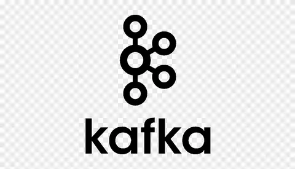

## Welcome to my profile!

## About Me
My name is Andrey and i'm a QA Engineer since January 2021. 

  

  

  

### Skills
- ### Java( in progress) :hotsprings: 
    - Backend testing (API, databases, Kafka)
    - UI testing
    - Some experience in mobile testing for Android/IOS devices.
  

## Technologies:

## Language

## IDEs

 

## Automotization frameworks

## Tools
 

## My Projects

## My Stats

  
  
  
  

## Contacts
- LinkedIn: 

